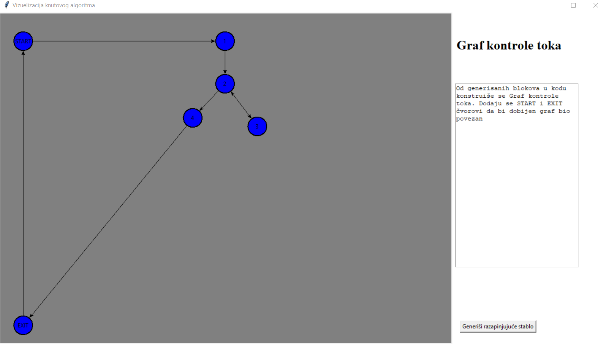

# Knuth algorithm visualisation improvements

This program visualises the implementation of the Knuth algorithm, an algorithm used within the proccess of edge profiling. The implementation itself follows the paper that can be found on this [link](http://www.verifikacijasoftvera.matf.bg.ac.rs/vs/predavanja/03_dinamicka_analiza/03_NevenaNikolic_ProfajliranjeIvica.pdf).  The proccess consists the following steps:

* The ability to choose the code input (added test inputs)
* Generating basic blocks from the code input
* Making the control-flow graph from the generated blocks
* Finding the spanning tree within the control-flow graph
* Finding the spanning tree inverse
* Adding the weights to the existing links
* Finding all other neccesary weights based on the Knuth algorithm using Kirchoff's law

All of the steps are presented seperately.

:warning: Currently the code only supports the predefinded input (v1.0)
(soon will support any input but with manual adding of the initial weights)

 ## :computer: Getting started

 These instructions will help you run and visualise Python code on your local machine. This version is mainly tested on Ubuntu and MacOS.


### Prerequisites

What things you need to install the software and how to install them

Python3 - version 3.6.5
```
$ python3 --version
Python 3.6.5
```

Tkinter
```
$ sudo pacman -S tk
```

## 🔌 How to run

```
python visualise.py
```

1. Choose an example you want to use as a code input (press the button) or write an example
2. Make sure that the code does not log any errors
2. Generate canvas
3. Procceed trough the steps using the next button


## :wrench: Built using
* [tkinter](https://docs.python.org/3/library/tkinter.html) -  Python interface to the Tk GUI toolkit

## :mortar_board: Authors

* **Jovana Bošković** - [jovana]()

* **Veronika Miljaković** -  [veronika]()

* **Milica Galjak** -  [milicagaljak](https://github.com/milicagaljak)


## :sunrise: App screenshot




